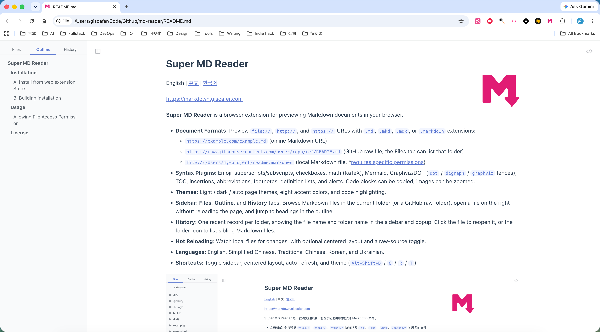

# Super MD Reader


[English](./README.md) | 中文 | [한국어](./README-ko.md)

在线安装： [Super MD Reader](https://chromewebstore.google.com/detail/super-md-reader/hpncdiedfhcnojbljonoboiffpmheflf)

**Super MD Reader** 是一款浏览器扩展，能在浏览器中快捷预览 Markdown 文档。

- **文档格式**: 支持预览 `file://`、`http://`、`https://` 协议以及 `.md`、`.mkd`、`.mdx`、`.markdown` 扩展名的文件:
  - `https://example.com/example.md`（在线 Markdown 链接）
  - `https://raw.githubusercontent.com/owner/repo/ref/README.md`（GitHub raw 文件；「文件」页可列出该目录）
  - `file:///Users/my-project/readme.markdown`（本地 Markdown 文件，[\*需要开启特定权限](#允许本地文件访问权限)）
- **语法插件**: 表情符号、上标/下标、复选框、数学公式（KaTeX）、Mermaid、Graphviz/DOT（`dot` / `digraph` / `graphviz` 代码块）、目录、插入、缩写、脚注、定义列表、提醒。代码块可一键复制，图片可点击放大。
- **主题**: 浅色 / 深色 / 跟随系统，8 套主题色，以及代码高亮。
- **侧边栏**: **文件**、**大纲**、**历史** 三个页签。可浏览当前文件夹（或 GitHub raw 目录）中的 Markdown，点击文件在右侧渲染而不整页刷新，大纲可跳转到标题。
- **历史记录**: 按父目录去重，侧边栏和弹窗显示文件名与文件夹名。点击文件重新打开，点击文件夹图标列出同目录下的其他 Markdown。
- **实时刷新**: 监听本地文件变更，可选择内容居中，并支持切换原始 Markdown 源。
- **语言**: 英语、简体中文、繁体中文、韩语、乌克兰语。
- **快捷键**: 切换侧边栏、居中、自动刷新、主题（`Alt+Shift+B` / `C` / `R` / `T`）。



默认的主题样式存储在 https://github.com/md-reader/theme 中。如果你想查看或自定义主题样式，可以访问该链接并根据需要调整 CSS 文件。

## 安装

### A. 在浏览器应用商店安装（需要机智上网）


### B. 本地构建

以 Chrome 为例：

1. 克隆本仓库到本地并编译:

   ```bash
   # 克隆本仓库
   git clone https://github.com/giscafer/super-markdown-reader.git && cd super-markdown-reader

   # 安装依赖
   pnpm install

   # 构建扩展程序
   pnpm build
   ```

2. 构建成功后，未打包的扩展目录在 `dist/md-reader`。

3. 打开 `chrome://extensions`，开启 **开发者模式**，点击 **加载已解压的扩展程序**，选择 `dist/md-reader` 文件夹即可。只需选一次。之后 `pnpm build` 或 `pnpm dev` 都会更新同一个目录。日常开发用 `pnpm dev`，扩展会自动热重载。

   如需上传商店，可额外执行 `pnpm zip` 生成 `dist/md-reader-x.y.z.zip`。

## 使用

以 Chrome 为例：

安装完成后，此时 Chrome 已经可以预览在线的 markdown 文档了，但是还不可以预览本地的 markdown 文档，需要开启 Chrome 扩展的文件访问权限。

### 允许本地文件访问权限

> 由于 Chrome 出于安全考虑，默认关闭了扩展程序对本地文件的访问权限，所以在安装完插件后需要手动开启权限，这样就可以正常预览本地 markdown 文件了。

在 Chrome 扩展程序管理页中，找到刚刚安装的 `Super MD Reader`，点击 `详细信息`，在详情页找到 `允许访问文件网址` 选项，然后切换为开启状态即可（请放心：`Super MD Reader` 只对 markdown 文件进行读取和展示的操作，不会修改和上传用户文件数据）。

<br/>

现在所有工作都完成啦~！ヾ(◍°∇°◍)ﾉ

打开这个在线文档试一下效果吧：[示例文档](https://raw.githubusercontent.com/giscafer/super-markdown-reader/main/example/example.md)；你还可以试试直接将 Markdown 文档 **拖进浏览器**！

欢迎提出你的使用问题和建议。

## 协议

License [MIT](./LICENSE)
